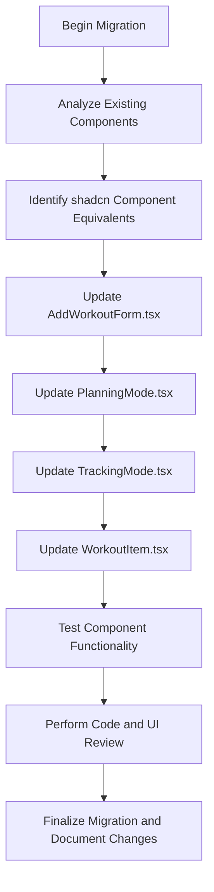

# Migration Plan to Integrate shadcn UI Components

## Task Analysis

**Purpose:**  
Migrate UI elements in the workout application to use shadcn components, ensuring a consistent UI and leveraging shadcn's design language.

**Technical Requirements:**  
- **Stack:** Next.js 15, TypeScript, Tailwind CSS V4, shadcn/ui.  
- **Functionality:** Preserve existing functionality and validations.

**Implementation Steps:**  
1. **Identify Migratable Parts:**  
   - *AddWorkoutForm.tsx*  
     - Replace native inputs with shadcn **Input** components.  
     - Replace the submit button with shadcn **Button**.  
     - Optionally wrap form fields in shadcn form elements.
     
   - *PlanningMode.tsx*  
     - Replace "Start Session" button with shadcn **Button**.  
     - Optionally use shadcn **Card** or **List** to wrap the workout list.
     
   - *TrackingMode.tsx*  
     - Replace the timer input (rest time) with shadcn **Input**.  
     - Replace timer control buttons (toggle, start/pause, reset) with shadcn **Button** components.  
     - Optionally wrap the timer section in a shadcn **Card**.
     
   - *WorkoutItem.tsx*  
     - Replace the remove (✕) button with a shadcn **IconButton** or styled **Button**.  
     - Replace the checkbox with shadcn **Checkbox**.  
     - Optionally wrap the workout item in a shadcn **Card**.

2. **Testing & Verification:**  
   - Verify that each migrated component maintains its functionality.  
   - Ensure visual consistency with the shadcn design language.

3. **Documentation:**  
   - Record all changes and rationale for the migration.  
   - Create and maintain a migration guide for future reference.

4. **Final Review and Deployment:**  
   - Conduct thorough code and UI reviews.  
   - Execute regression tests before final deployment.

## Implementation Diagram

## Next Steps

- Use this plan as a reference during the migration.
- Switch to Code mode to implement the migration changes.